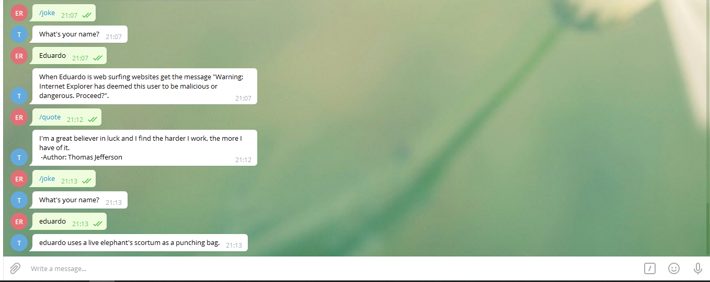

# TheSimpleBot

> This is a simple Telegram bot



This is, as the name suggest, a simple Telegram bot. The goal of this project is
to build a bot capable of: Telling a joke with your name and give you a quote.
This project is my solution to Microverse's Capstone project "Build Your Own Bot".
Feel free to clone and modify this project.
Important reminder, I'm not using a database if you are going to have a lot of
persons using your custom bot, consider using a database
otherwise you will run into memory management problems.


## Built With

- Major languages: Ruby.
- frameworks: No frameworks were used.
- technologies used: This project was built using just The programming language Ruby

## Live Demo

[Live Demo Link](https://livedemo.com)


## Getting Started

**This set of instructions is designed to be used in linux systems.**


To get a local copy up and running follow these simple steps.

First of all, make sure you have git installed. If you don't have it installed
run the following command:
```bash
$ sudo apt-get install git
```

To clone this repository locally using ssh:
```bash
$ git clone git@github.com:eduardoreisalvarenga/CapstoneProject_TelegramBot.git
```

Or if you can't use ssh, use this command to download using HTTPS:
```bash
$ git clone https://github.com/eduardoreisalvarenga/CapstoneProject_TelegramBot.git
```

### Prerequisites
This project was built using ruby version ruby 2.7.0p0. You will need to have at least
ruby version 2.5 or later versions in your computer to run it. This project probably
will work with older ruby versions, but it's not recommended. It was only tested using
version 2.5 to 2.7. <br>
To install ruby. This command will install the last version:
```bash
$ sudo apt-get install ruby-full
```
<br>
To make things easier I'm using some gems: dotenv, telegram-bot-ruby, rest-client and json. Dotenv is a
gem used to safely store my passwords, this way I will not send my private keys
to github by mistake. telegram-bot-ruby is a gem to help you when coding telegram bots.

To install dotenv:
```bash
$ gem install dotenv
```
To install telegram-bot-ruby:
```bash
$ gem install telegram-bot-ruby
```
To install rest-client:
```bash
$ gem install rest-client
```
To install json:
```bash
$ gem install json
```

### Setup
For security reasons I've removed my private keys. You will need to follow these
steps to add your own private key: <br>
Go to your Telegram app and search for @BotFather and start a new chat with it. <br>
Type /start <br>
Type /newbot <br>
Choose a name for your bot. You can choose any name. <br>
Choose a username for your bot. Same here, choose any user name. <br>
You will receive a message congratulating you. Save the HTTP token, you will need it to use
the bot.

### Install
Go to your CapstoneProject_TelegramBot and add a file called .env <br>
Now add this to your .env file: export API_KEY = My_API_Key_Here <br>
Change My_API_Key_Here to the token you saved earlier.

### Usage
Now you are ready to go. Inside the folder CapstoneProject_TelegramBot type the command:
```bash
$ ruby bin/main
```
You have a functional bot.
To interact with it go to Telegram and search for your bot, remember to use the name you created
with BotFather. <br>
To see a joke with your name:
```bash
/joke
```
To receive a quote:
```bash
/quote
```
To see useful information about commands:
```bash
/help
```

## Author

👤 **Eduardo**

- Github: [@githubhandle](https://github.com/eduardoreisalvarenga)
- Twitter: [@twitterhandle](https://twitter.com/eduardodosrei11)
- Linkedin: [linkedin](https://www.linkedin.com/in/eduardo-alvarenga-44204818a/)


## Contributing

Contributions, issues and feature requests are welcome!

## Show your support

Give a ⭐️ if you like this project!!

## License

This project is [MIT](https://opensource.org/licenses/MIT) licensed.
